# Intelligent Next Best Action

**Turn raw business signals into explainable, confidence-scored Next Best Actions that a human approves in one click, and that get measurably smarter every time.**

XLVentures Hackathon, Project 2 (selected).

## The problem

Operators drown in dashboards but starve for decisions. A Customer Success Manager can see that an account is slipping, yet still has to guess what to do, justify it to a skeptical stakeholder, and hope it works. Most "AI" tools stop at a prediction or a chat reply: no ranked options, no reasoning a human can audit, no guardrails, and no memory of what actually worked last time.

Project 2 asks for an agentic decision engine. We built a domain-agnostic one. It ingests signals, plans a strategy, runs specialist agents, retrieves precedent, scores confidence, enforces policy, and proposes a **Next Best Action** with ranked alternatives and a plain-language rationale. A human approves or rejects, the action executes, the outcome is recorded, and the system distills that feedback into reusable lessons. The flagship domain is Customer Success and churn, but the engine specializes to any vertical through YAML Domain Packs (data, not code).

## Architecture overview

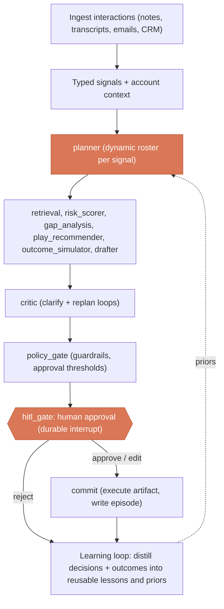

Node names above match the LangGraph nodes in `backend/app/graph/planner.py`. The planner picks a roster per signal, so not every specialist runs on every request; `gap_analysis` and `critic` always run.

> Full diagrams (system, decision lifecycle, LangGraph orchestration, retrieval and learning loop) are in [`ARCHITECTURE.md`](ARCHITECTURE.md).

- **Planner + specialist agents:** a LangGraph orchestrator builds a plan per request and dispatches specialist nodes (risk analysis, action drafting, retrieval, explanation). Durable checkpointing lets a run pause at a human-approval interrupt and resume later.
- **Memory and learning:** approvals, rejections, and downstream outcomes are stored and distilled into lessons that bias future planning and confidence scoring.
- **Retrieval:** precedent and policy context are pulled from a pgvector store so recommendations cite similar past situations.
- **Policy:** a guardrail layer evaluates each candidate against domain limits and approval thresholds before it is ever shown.
- **Eval:** a golden-scenario harness scores recommendation quality across components and outcomes, so changes are measured, not guessed.

## The 7-step workflow, mapped to the real nodes

The end-to-end decision flow maps directly onto the LangGraph nodes in `backend/app/graph/planner.py` (and the ingest connector that feeds them). This is the platform, step by step:

| # | Step | What happens | Where in code |
| --- | --- | --- | --- |
| 1 | Ingest interactions | Meeting notes, transcripts, emails, CRM updates, and conversations are chunked, embedded, and stored as citeable evidence | `POST /ingest` (`app/api/ingest.py`, `app/retrieval/connectors`) |
| 2 | Gather org context | KB, playbooks, best practices, product docs, CRM, and customer history are made retrievable per org | `retrieval` node + pgvector store (`app/retrieval/`) |
| 3 | Plan | The planner classifies the signal to a decision point and selects the specialist roster for this request | `planner` node |
| 4 | Analyze opportunities, risks, and missing info | Evidence retrieval, risk scoring, and explicit gap analysis of what is still unknown | `retrieval`, `risk_scorer`, `gap_analysis` nodes |
| 5 | Recommend the NBA | Plays are ranked, the outcome is simulated, the artifact is drafted, and the critic checks the result (replanning if needed) | `play_recommender`, `outcome_simulator`, `drafter`, `critic` nodes |
| 6 | Explain with evidence and confidence, then gate | A structured recommendation (primary action, ranked alternatives, citations, confidence, simulated outcome) is checked against policy and routed for human approval | `policy_gate`, `hitl_gate` nodes (`app/explain/`, `app/policy/`) |
| 7 | Commit and learn | On approval the action executes into an artifact, the decision becomes an episode, and the loop distills it into reusable lessons | `commit` node, `/execute`, `/learning` (`app/memory/`) |

`gap_analysis` can loop back to `retrieval` when grounding is thin, and `critic` can trigger a bounded replan to `retrieval` or `play_recommender`, so the graph clarifies and self-corrects rather than running a fixed line.

## Agent and tool registry

Specialists are not hardcoded into the graph: they are registered capabilities resolved by name from the agent registry (`backend/app/packs/registry.py`), so the planner composes a roster and new agents slot in without rewriting orchestration.

| Capability | Role | Always on |
| --- | --- | --- |
| `retrieval` | Hybrid vector plus lexical search over the org KB, returns ranked chunks with span citations | roster |
| `risk_scorer` | Scores the threat or opportunity from signals and account state | roster |
| `gap_analysis` | Flags missing information and can request more grounding | yes |
| `play_recommender` | Ranks candidate plays from the domain pack against the situation | roster |
| `outcome_simulator` | Projects the KPI impact of the leading play | roster |
| `drafter` | Generates the concrete artifact (email, CRM task, Slack handoff) | roster |
| `critic` | Validates the recommendation and triggers replan or clarify on failure | yes |

The registry is browsable at runtime through `GET /agents` and `GET /tools`.

## Key features

- **Explainable recommendations:** every NBA ships with a plain-language rationale, the signals that drove it, and a calibrated confidence score.
- **Ranked alternatives:** not one answer but a ranked slate, each with its own tradeoffs, so the human stays in control.
- **Counterfactual what-if:** adjust a signal or assumption and re-score instantly to see how the recommendation would change.
- **Learning loop:** human yes/no plus real outcomes are distilled into reusable lessons that move future confidence and ranking.
- **Guardrails:** policy evaluation enforces hard limits and approval thresholds; risky actions require sign-off.
- **One-click execution:** approve to execute, with the artifact (for example a drafted outreach) previewed before it goes out.
- **Multi-domain packs:** swap the YAML Domain Pack to retarget the engine (Customer Success, SaaS Sales, Collections shipped) with no code changes.
- **Multi-tenant by default:** every request resolves an org from an httpOnly `nba_session` cookie, and accounts, episodes, rules, and integrations are all scoped per tenant. Sign in with email and password or with Google.
- **Configurable rules:** each org can tailor a pack's policy guardrails and action catalog from the UI (`/rules/{domain}`) as an additive override, with no fork of the base pack.
- **Real integrations:** outbound connectors for AWS SES email, Slack (incoming webhook), plus Google sign-in, configured per org and all offline-safe (an unconfigured connector degrades to a no-op).
- **Agentic copilot:** operate every capability in plain language. The model calls real platform tools (run an NBA, search the knowledge base with citations, send a composed email to a saved contact, edit the workflow), grounded first in your ingested data.
- **Workflow Studio:** a visual node graph of the agent pipeline. Toggle which specialists run per decision point, or just tell the built-in chatbot to change it, and the planner honors it per org at run time.
- **Admin and OpenAI cost:** an allowlist-gated panel for signups, per-org activity, and OpenAI token usage and dollar cost.
- **Passkeys:** passwordless WebAuthn sign-in, alongside email/password and Google.
- **Live web search:** the copilot can pull fresh external context via Serper, secondary to your own ingested evidence.

## Screenshots

The decision inbox: accounts ranked by churn risk and signal recency, not another alert feed.

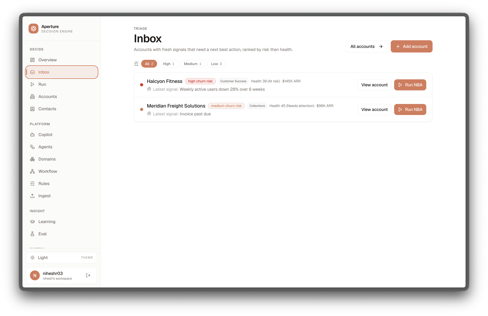

A Next Best Action: planner trace, the explainable recommendation, calibrated confidence, cited evidence, ranked alternatives, policy gate, and human approval.

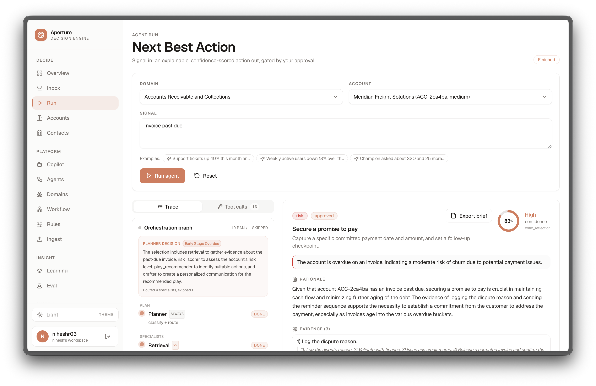
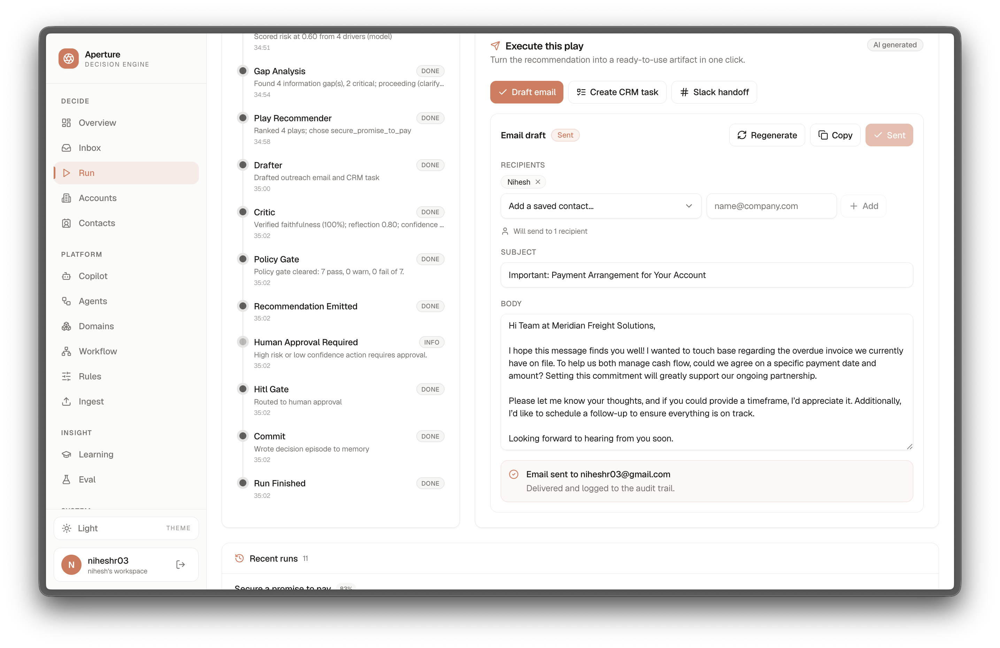

The agentic copilot: drive the platform in plain language; every step is a real tool call, gated by human approval.

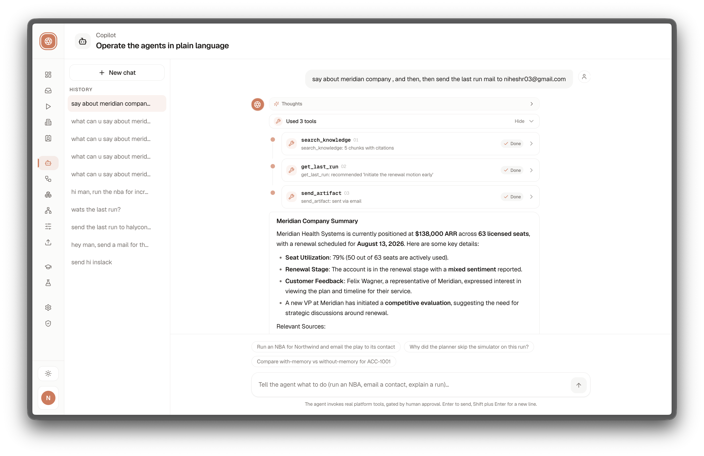

Workflow Studio: the agent graph per decision point. Toggle specialists, or edit the workflow with the context-aware chatbot.

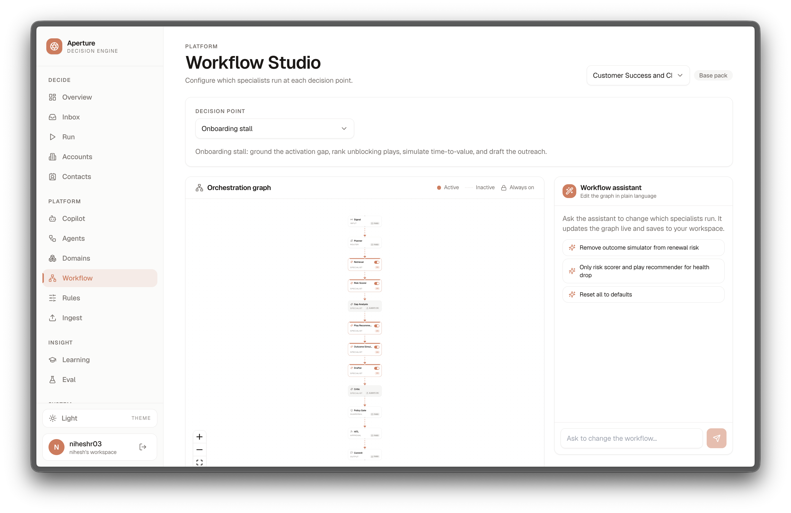

The reusable agent and tool registry, surfaced directly.

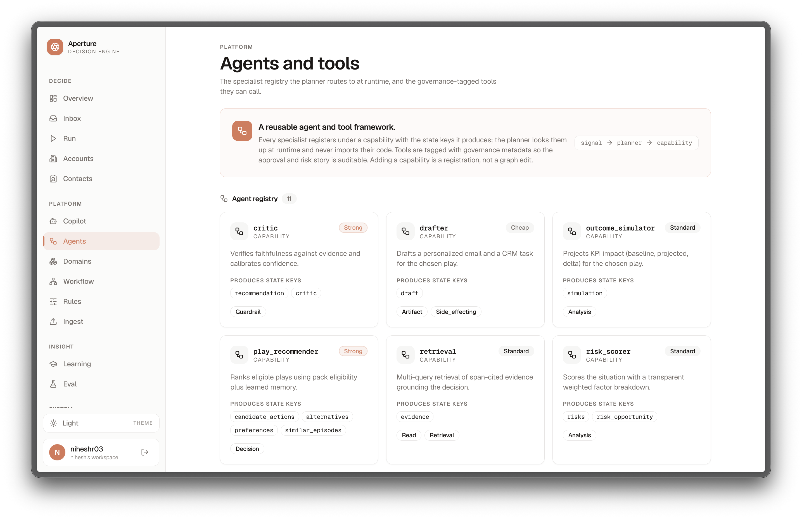

Domains as data: swap a YAML pack to retarget the engine (Customer Success, SaaS Sales, Collections).

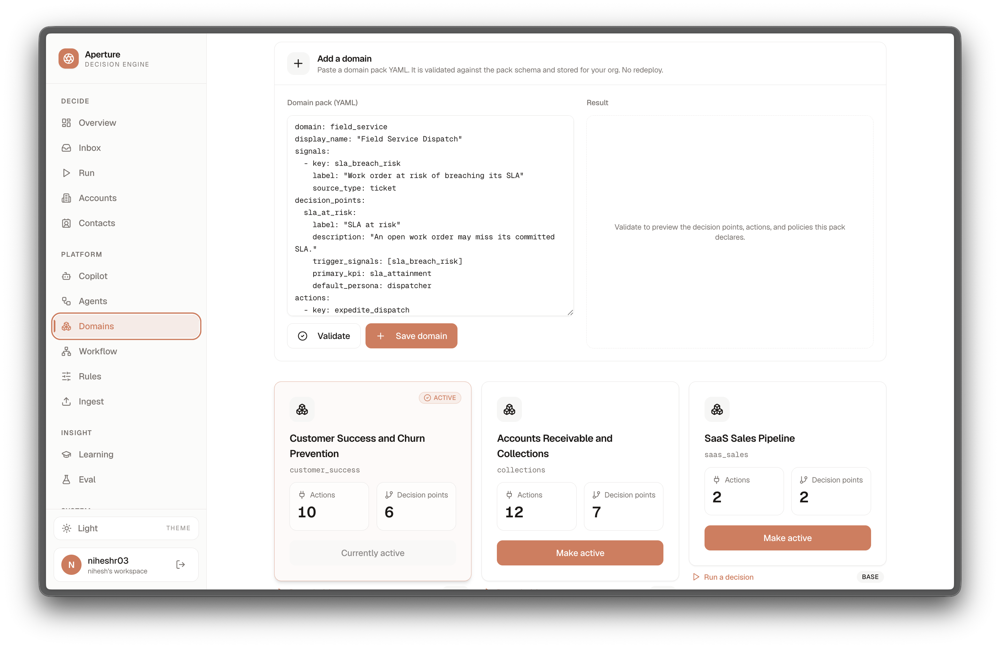

Ingest interactions (notes, transcripts, emails) into the retrieval corpus as cited evidence.

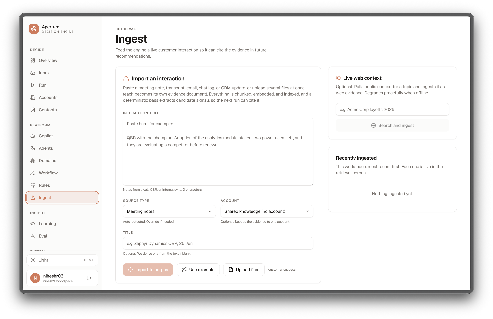

Admin panel: signups, per-org usage, and OpenAI cost.

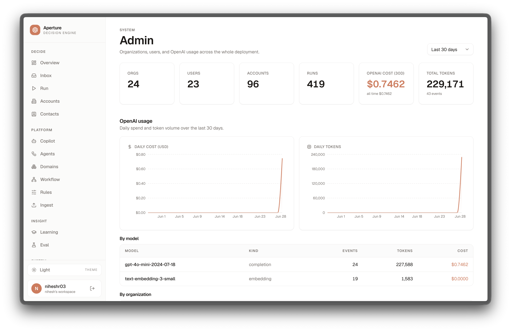

Overview and settings (passkeys, workspace).

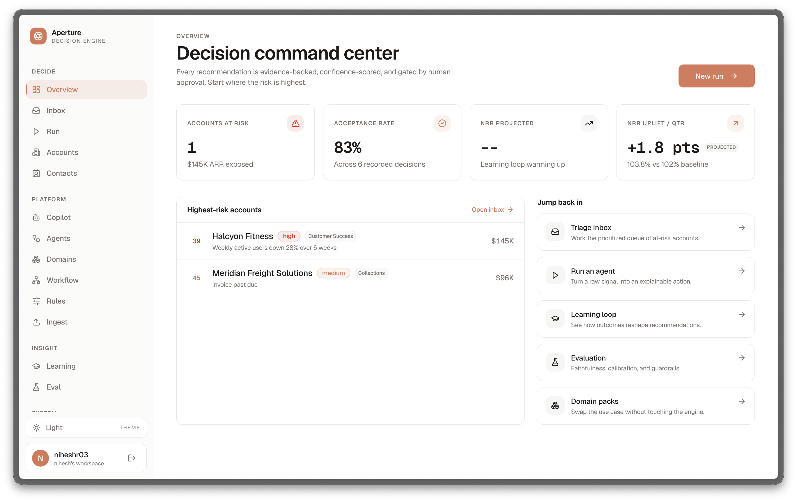
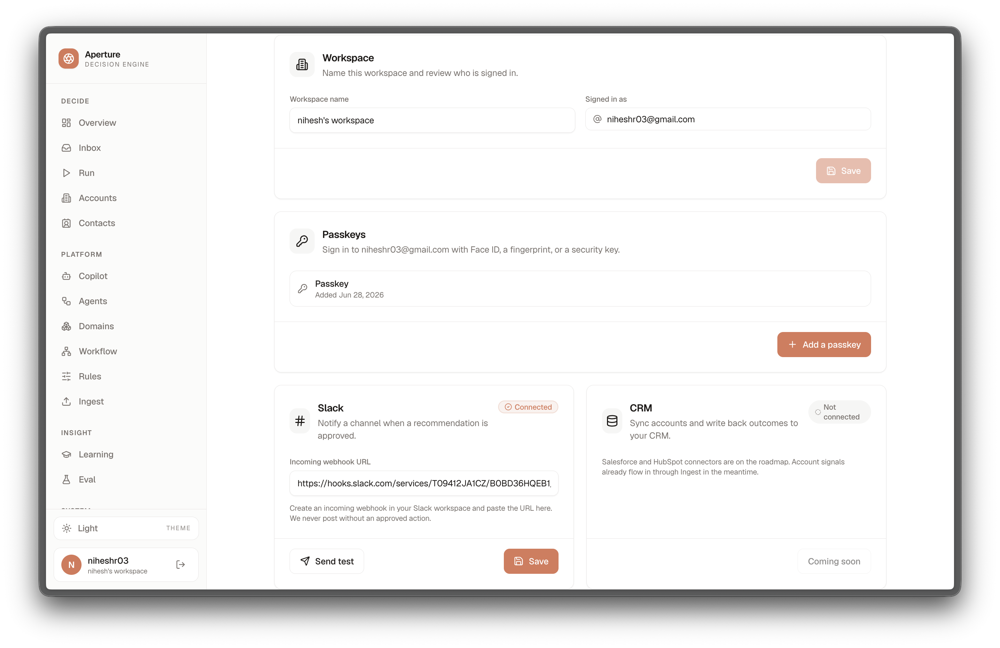

## Tech stack

| Layer | Choice |
| --- | --- |
| Orchestration | LangGraph (planner, specialist agents, checkpointing, HITL interrupts, memory store) |
| Backend | Python 3.12, FastAPI, Uvicorn, SSE streaming |
| Data | Postgres 17 + pgvector |
| LLM | OpenAI via langchain-openai |
| Frontend | Next.js 15 (App Router), React 19, Tailwind, shadcn-style UI, lucide icons |
| Auth | httpOnly `nba_session` JWT cookie, per-org isolation, optional Google sign-in |
| Integrations | AWS SES email, Slack webhook, Google (all per-org, offline-safe) |
| Contracts | Shared OpenAPI + JSON Schemas in `contracts/` |
| Domain config | YAML Domain Packs in `domain_packs/` |
| Infra | Docker Compose, Alembic migrations |

**Offline first:** the whole system runs with no `OPENAI_API_KEY` and no `DATABASE_URL`. Missing services fall back to deterministic stubs so the demo and tests are reproducible on any laptop.

## Repo layout

```
backend/        FastAPI + LangGraph orchestration, memory, retrieval, policy, eval
frontend/       Next.js + shadcn-style UI
contracts/      Shared OpenAPI + event + recommendation JSON schemas
domain_packs/   YAML domain configs (data, not code)
infra/          docker-compose, Dockerfiles
docs/           PLAN.md and design docs
```

## How to run

Config lives in a single root `.env` (already templated in `.env.example`). Every value is optional: with all blanks the app runs fully offline with deterministic stubs (no OpenAI key, no database). Copy the template if you do not already have a `.env`:

```bash
cp .env.example .env
```

### Quickstart (two terminals)

```bash
# terminal 1: backend (loads ./.env, http://localhost:8200)
make install        # cd backend && uv sync --extra dev
make api            # live mode (uses OPENAI_API_KEY if set, else offline)
#   or: make demo   # offline deterministic mode (no API keys), for recording

# terminal 2: frontend (http://localhost:3200)
cd frontend && npm install && npm run dev
```

Open http://localhost:3200 and sign in with the seeded demo account (**demo@niheshr.com** / **demo1234**), or sign in with Google if it is configured. The backend env (including `APP_TOKEN`, `DATABASE_URL`) is loaded from `./.env` via `uv run --env-file`. The frontend reads `NEXT_PUBLIC_API_URL` from `frontend/.env.local`.

One-command alternative (Docker): `make dev` brings up Postgres + pgvector, the API, and the web app together, reading the same root `.env`.

### Backend (uv)

The backend is a [uv](https://docs.astral.sh/uv/) project (dependencies pinned in `backend/uv.lock`).

```bash
cd backend
uv sync                                  # create .venv and install from the lockfile
uv run uvicorn app.main:app --reload --port 8200
```

`uv sync` installs runtime deps; add `--extra dev` for tests and tooling. Any `uv run <cmd>` executes inside the managed environment, so no manual venv activation is needed.

The API serves on http://localhost:8200 (interactive docs at `/docs`).

### Frontend (npm)

```bash
cd frontend
npm install
npm run dev
```

The UI serves on http://localhost:3200 and talks to the API at `NEXT_PUBLIC_API_URL`.

### Docker Compose (one command)

Brings up Postgres + pgvector, the API, and the web app together:

```bash
make dev      # docker compose -f infra/docker-compose.yml up
make down     # tear everything down
make migrate  # apply Alembic migrations inside the api container
```

### Environment

All configuration lives in `.env` (see `.env.example`):

- `OPENAI_API_KEY` (optional): blank uses the deterministic LLM fallback.
- `DATABASE_URL` (optional): blank runs DB-less with in-memory stores.
- `NEXT_PUBLIC_API_URL`: where the frontend reaches the API.
- `APP_TOKEN` (optional): when set, execution endpoints require `Authorization: Bearer <APP_TOKEN>`; blank keeps open demo mode.
- `LANGSMITH_API_KEY`, `LANGSMITH_TRACING`: optional tracing.

## How to seed

```bash
make seed     # cd backend && uv run python -m app.seed
```

Loads demo accounts, signals, and precedent for the flagship Customer Success domain so the UI has something to recommend against immediately.

## Tests and eval

```bash
# unit + integration tests
cd backend && uv run pytest      # or: make test

# recommendation quality eval (golden scenarios)
make eval     # cd backend && uv run python -m app.eval.runner
```

The eval harness scores components and outcomes against `backend/app/eval/golden.jsonl` and writes the latest run summary to `backend/app/eval/_last_run.json`. Both tests and eval run fully offline.

## API surface

| Method | Path | Purpose |
| --- | --- | --- |
| GET | `/health` | Liveness check |
| POST | `/auth/login`, `/auth/signup`, `/auth/logout`, `/auth/me` | Session auth (issues the httpOnly `nba_session` cookie) |
| GET | `/auth/google/start`, POST `/auth/google/exchange` | Optional Google sign-in flow |
| POST | `/ingest` | Ingest an interaction (note, transcript, email, CRM) into the retrieval corpus |
| GET | `/agents`, `/tools` | Browse the agent and tool registry |
| POST | `/runs` | Start a decision run for an account or signal set |
| GET | `/runs/{run_id}/stream` | Stream planner + agent steps and the final recommendation (SSE) |
| POST | `/runs/{run_id}/hitl` | Approve or reject at the human-in-the-loop interrupt |
| GET | `/accounts` | List accounts |
| GET | `/accounts/{account_id}` | Account detail with signals and history |
| GET | `/domains` | List installed Domain Packs |
| GET | `/domains/{domain_key}` | Domain Pack detail |
| POST | `/whatif` | Counterfactual re-scoring of a recommendation |
| GET | `/policy/{domain}` | Policy and guardrails for a domain |
| POST | `/policy/evaluate` | Evaluate a candidate action against policy |
| GET / PUT | `/rules/{domain}` | Read or save this org's policy and action overrides |
| GET / PUT | `/integrations`, `/integrations/{kind}` | Manage per-org SES, Slack, and Google connectors |
| GET | `/contacts` | List and manage org contacts |
| POST | `/execute` | Execute an approved action |
| GET | `/execute/{run_id}` | Execution status and artifact |
| GET | `/learning` | Distilled lessons and learning state |
| POST | `/learning/distill` | Distill recent feedback into lessons |
| POST | `/learning/outcome` | Record a downstream outcome |
| GET | `/eval` | Latest eval run summary |

The full contract lives in `contracts/openapi.json`, with recommendation and event shapes in `contracts/recommendation.schema.json` and `contracts/events.schema.json`.

## Add a domain (no code)

The engine is domain-agnostic: a domain is data, not code. To retarget the platform to a new vertical, drop a YAML file in `domain_packs/<your_domain>.yaml` and it loads automatically (validated against `backend/app/packs/schema.py`). A pack declares:

- `personas`, `signals`, and `decision_points` (each with its trigger signals, primary KPI, and an optional specialist `roster` and `rationale` so the planner routes the way you intend).
- `actions` and `playbooks` (the candidate plays the recommender ranks), `kpis`, and `retrieval_sources` (the knowledge scope).
- `policy` guardrails (the rules the `policy_gate` enforces) and optional narrative `business_process`, `customer_journey`, and `success_metrics` that make the domain legible without changing engine behavior.

Three packs ship today (`customer_success`, `saas_sales`, `collections`) as working references. The same graph, retrieval, policy, and explanation all retarget with zero code changes. For lighter tweaks, an org can override an existing pack's rules and action catalog at runtime from the UI via `PUT /rules/{domain}` without touching the base file.

## Demo walkthrough

A tight 5-minute story. For a fully offline, reproducible recording, boot the API with no API keys (a deterministic model is used):

```bash
make demo      # backend on http://localhost:8200 (deterministic, no API keys)
```

Then in another terminal start the UI (`cd frontend && npm install && npm run dev`, http://localhost:3200). Every API call below also lives as a ready-to-run example in `scripts/requests.http` (VS Code REST Client, JetBrains, or curl).

1. **Open the inbox.** The accounts list surfaces an at-risk account: Northwind Logistics (`ACC-1001`), health 42, usage down 38 percent after an integration broke and the champion left.
2. **Run the engine.** Kick off a run on that account and watch the trace stream: the planner picks specialists, risk analysis scores the threat, the drafter proposes an action, retrieval cites a similar past account.
3. **Read the explainable NBA.** The Next Best Action lands with a confidence dial, a plain-language rationale, cited evidence, ranked alternatives, and the policy gates that must clear before it can ship.
4. **Approve and execute.** Clear the human-in-the-loop interrupt with one click, preview the drafted artifact (email, CRM task, or Slack), and execute.
5. **Show the learning improvement.** Record the outcome and distill it into a lesson, then refresh `/eval` to see the score move.
6. **Swap the domain pack.** Switch to SaaS Sales or Collections to prove the same engine retargets with zero code changes.

For the recorded video, follow the full beat-by-beat, time-stamped runbook (0:00 to 5:00, each beat tied to a rubric criterion) in [`ARCHITECTURE.md`](ARCHITECTURE.md#5-minute-demo-script). The companion **5-minute architecture walkthrough script** (design-decision narration over the mermaid diagrams) lives in the [same file](ARCHITECTURE.md#5-minute-architecture-walkthrough-script).

## How this maps to the judging rubric

**Platform (70 percent)**

- *Agentic orchestration:* a real planner that composes specialist agents per request, with durable checkpointing and human-in-the-loop interrupts (LangGraph), not a single prompt.
- *Explainability and trust:* every recommendation carries confidence, rationale, cited precedent, and ranked alternatives; guardrails gate risky actions.
- *Learning:* a closed feedback loop distills approvals, rejections, and outcomes into reusable lessons that measurably move future decisions.
- *Reliability and rigor:* offline-deterministic fallbacks, shared contracts, Alembic migrations, a golden-scenario eval harness, and CI on every push.
- *Extensibility:* Domain Packs make the platform domain-agnostic by configuration, demonstrated across three verticals.

**Use case (30 percent)**

- *Real pain, real stakes:* churn and net revenue retention are board-level metrics; faster, defensible, learning-backed decisions directly protect revenue.
- *Operator-ready:* one-click execution with artifact preview and counterfactual what-if fits the daily workflow of a Customer Success Manager.
- *Generalizable:* the same flow already serves SaaS Sales and Collections, showing the use case is a wedge, not a ceiling.

## Deliverables

- **Five-minute demo video:** recorded against the time-stamped runbook in [`ARCHITECTURE.md` (5-minute demo script)](ARCHITECTURE.md#5-minute-demo-script).
- **Five-minute architecture walkthrough:** narrated from the [`ARCHITECTURE.md` (5-minute architecture walkthrough script)](ARCHITECTURE.md#5-minute-architecture-walkthrough-script), which walks the mermaid diagrams in that file.
- **This repository:** full source, contracts, domain packs, infra, and setup, with `ARCHITECTURE.md` as the design reference and this `README.md` as the entry point.

See `docs/PLAN.md` for the phased build roadmap.
